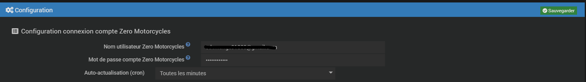
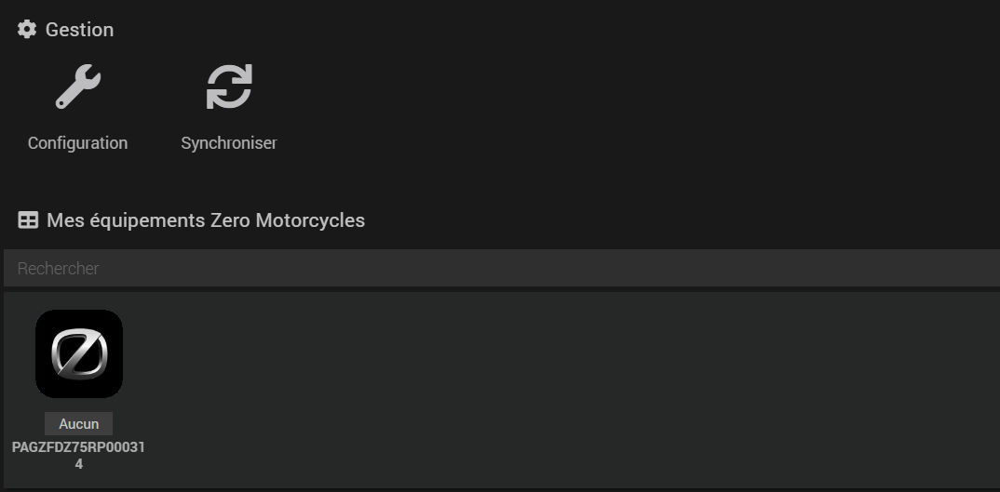

Description
===
Ce plugin permet de récupérer les informations liées à un véhicules zero motorcycles

Prérequis
---
Avoir crée son compte sur l'application mobile Zero Next Gen

Paramétrage du plugin
---
Le plugin doit se connecter à votre compte Zero, il a donc besoin  
* de vos identifiants / mot de passe

Cron
---
Le plugin vous offre la possibilité de choisir le cron de MAJ de toutes les infos

Récupération des véhicules
---
Une fois le plugin installé:

- cliquez sur Plugins > Objets Connectés > Zero motorcycles
- puis cliquez sur l'icône Synchroniser

Tous les véhicules liés à votre compte Zero doivent remonter.

